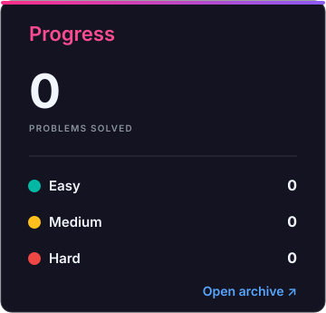
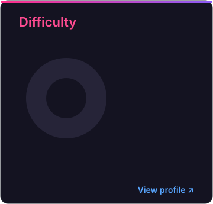

# Data-structure-
solving the leetcode problem realted to data structure from basic to high level

<!-- SOLUTIONS_START -->

<p align="center">
<a href="#solution-archive"></a><a href="#solution-archive"></a><a href="https://leetcode.com/problemset/"></a>
</p>

<!-- LEETBRIDGE_ARCHIVE_CELLS_V3 -->
<a name="solution-archive"></a>
<p align="center"><picture>

</picture></p>
<table align="center" width="100%">
<tbody>
</tbody>
</table>

<!-- SOLUTIONS_END -->


## Linked List Practice

- [simple_linkedlist.cpp](simple_linkedlist.cpp) — a beginner-friendly singly linked list implementation in C++.

### Included operations

- Print the list
- Insert at the beginning
- Insert at the end
- Search for a value
- Count nodes

### Example output

```text
List: 5 10 20 30 40
Nodes: 5
Search 20: found
```
