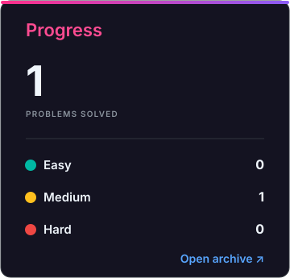
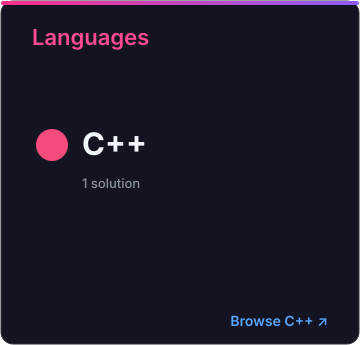
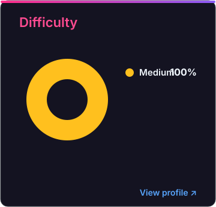

# Data-structure-
solving the leetcode problem realted to data structure from basic to high level

<!-- SOLUTIONS_START -->

<p align="center">
<a href="#solution-archive"></a><a href="https://github.com/kanishkaGO/Data-structure-/search?q=language%3AC%2B%2B&amp;type=code"></a><a href="https://leetcode.com/u/37spuvx5Al/"></a>
</p>

<!-- LEETBRIDGE_ARCHIVE_CELLS_V3 -->
<a name="solution-archive"></a>
<p align="center"><picture>

</picture></p>
<table align="center" width="100%">
<tbody>
<tr><td width="53%"><a href="https://leetcode.com/problems/design-linked-list/"></a></td><td width="17%"><picture></picture></td><td width="30%"><a href="0707-design-linked-list/solution.cpp"></a></td></tr>
</tbody>
</table>

<!-- SOLUTIONS_END -->

## Linked List Practice

- [simple_linkedlist.cpp](simple_linkedlist.cpp) — a beginner-friendly singly linked list implementation in C++.

### Included operations

- Print the list
- Insert at the beginning
- Insert at the end
- Search for a value
- Count nodes

### Example output

```text
List: 5 10 20 30 40
Nodes: 5
Search 20: found
```
